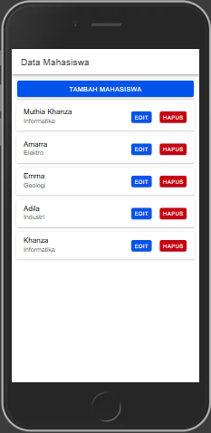
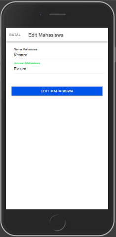

# Praktikum Mobile Pertemuan 9

Nama : Muthia Khanza
NIM : H1D022008
Shift Baru : C
Shift Lama : A

Pada tampilan awal akan dimunculkan beberapa data mahasiswa yang sudah ada dengan menggunakan fungsi getMahasiswa() yang dipanggil saat komponen diinisialisasi (ngOnInit). Fungsi ini mengambil data dari tampil.php melalui this.api.tampil('tampil.php'). Respon dari API disimpan dalam this.dataMahasiswa, yang kemudian ditampilkan pada template menggunakan ngFor="let item of dataMahasiswa". Data ini ditampilkan sebagai daftar mahasiswa dengan nama dan jurusan di setiap ion-card.

Tampilan ini menunjukan tampilan untuk menambahkan data mahasiswa, terdapat metode openModalTambah (isOpen: boolean) yang akan membuka modal untuk menambah mahasiswa jika parameter isOpen bernilai true. Dalam modal tambah, terdapat input untuk nama dan jurusan. Ketika tombol "Tambah Mahasiswa" diklik, metode tambahMahasiswa() dijalankan.Selanjunya tambahMahasiswa() membuat objek data berisi nama dan jurusan, lalu mengirimnya ke API menggunakan this.api.tambah(data, 'tambah.php'). Jika proses tambah berhasil, data mahasiswa akan diambil ulang dengan this.getMahasiswa() untuk memperbarui tampilan, lalu modal ditutup.

Setelah data berhasil ditambahkan maka akan muncul pada halaman awal seperti ini.

Untuk mengedit data mahasiswa, terdapat metode openModalEdit(isOpen: boolean, idget: any) yang membuka modal edit dan mengambil data mahasiswa berdasarkan id. Selanjutnya fungsi ambilMahasiswa(id: any) dipanggil untuk mengambil data spesifik dari lihat.php?id= dan menyimpan data ke dalam variabel id, nama, dan jurusan. Saat data mahasiswa yang akan diedit telah dimuat, tombol "Edit Mahasiswa" akan memanggil editMahasiswa(). Fungsi ini membuat objek data berisi id, nama, dan jurusan, lalu mengirimnya ke API melalui this.api.edit(data, 'edit.php'). Jika edit berhasil, data diperbarui dengan memanggil getMahasiswa().

Setelah data berhasil diedit maka tampilan data mahasiswa berubah sesaui dengan yang telah diedit sebelumnya.

Selanjutnya untuk menghapus data mahasiswa pengguna dapat menekan tombol Hapus, metode confirmDelete(id: any) dijalankan. Jika pengguna mengonfirmasi penghapusan, fungsi proceedToDelete() akan dijalankan untuk memanggil hapusMahasiswa(this.selectedIdToDelete). Metode hapusMahasiswa(id: any) menghapus data dari hapus.php?id=. Jika penghapusan berhasil, data mahasiswa diperbarui dengan memanggil getMahasiswa().

Setelah data berhasil dihapus maka data yang dihapus akan hilang dari tampilan.
